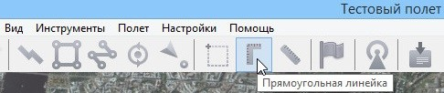

Интерфейс программы, режимы работы
=========================================

Запуск программы
-------------------------------------------

Запуск программы осуществляется через ярлык программы GeoScan Planner с рабочего стола.

   Рис. 1. Ярлык запуска программы GeoScan Planner

При запуске программы GeoScan Planner появляется окно аутентификации, требующее логин и пароль пользователя (рис. 2). Введите Ваши данные.

   Рис. 2. Окно аутентификации в GeoScan Planner

Интерфейс программы
------------------------------

Вид окна программы представлен на рис. 3.

   Рис. 3. Интерфейс программы GeoScan Planner

В окне программы Geoscan Planner отображаются следующие компоненты: 

* 1 - Интерактивная карта. Перемещение по карте осуществляется мышью с нажатой левой кнопкой или«стрелками» на клавиатуре.Нажатие и удержание клавиши «Shift» переводит карту в режим трехмерной прокрутки (изменение наклона камеры). Также для трехмерной прокрутки можно использовать мышь с нажатой правой кнопкой или клавиши PgUp, PgDn. Масштаб карты изменяется клавишами «+», «-» или вращением колесика мыши; 

* 2 - Панель инструментов (рис. 4). На панель инструментов вынесены кнопки для создания новых проектов,проектирования полетных элементов, выполнения измерений по карте. При подключении к борту появляются дополнительные кнопки для управления бортом;

.. Рис. 4. Панель инструментов

* 3 - Строка состояния, несущая информацию о текущем масштабе, координатах и высоте рельефа в точке курсора; 

* 4 - Кнопки переключения режимов.

**Панель инструментов.** Кнопки на панели инструментов расположены в предполагаемом порядке их применения при создании типового проекта.Некоторые кнопки изменяют назначение или появляются только после подключенияБВС

На рис.5 изображена панель инструментов доподключения БВС.

.. figure:: _static/_images/planer_gen/panel_do_2.jpg 
   :align: center
   :width: 600

   Рис. 5. Панель инструментов ДО подключения к борту

+----+----------------------------------+
| 1  | Новый проект                     |
+----+----------------------------------+
| 2  | Мои проекты                      |
+----+----------------------------------+
| 3  | Отменить                         |
+----+----------------------------------+
| 4  | Повторить                        |
+----+----------------------------------+
| 5  | Создать точку ожидания           |
+----+----------------------------------+
| 6  | Создать панорамную съемку        |
+----+----------------------------------+
| 7  | Создать площадную аэрофотосъемку |
+----+----------------------------------+
| 8  | Создать линейную аэрофотосъемку  |
+----+----------------------------------+
| 9  | Указать точку посадки            |
+----+----------------------------------+
| 10 | Создать полет по точкам          |
+----+----------------------------------+
| 11 | Прямоугольная линейка            |
+----+----------------------------------+
| 12 | Линейка                          |
+----+----------------------------------+
| 13 | Создать метку                    |
+----+----------------------------------+
| 14 | Подключить БВС                   |
+----+----------------------------------+
| 15 | Файл привязки                    |
+----+----------------------------------+

После подключения БВС на панель инструментов добавляются дополнительные кнопки (рис. 6).

   Рис. 6. Панель инструментов ПОСЛЕ подключения к борту

+----+---------------------------+
| 1  | Изменить полетное задание |
+----+---------------------------+
| 2  | Отключить БВС             |
+----+---------------------------+
| 3  | Найти БВС                 |
+----+---------------------------+
| 4  | Предстартовая подготовка  |
+----+---------------------------+
| 5  | Старт                     |
+----+---------------------------+
| 6  | Возврат                   |
+----+---------------------------+
| 7  | Посадка                   |
+----+---------------------------+
| 8  | Остановка двигателей      |
+----+---------------------------+
| 9  | Полет по требованию       |
+----+---------------------------+
| 10 | Сделать снимок            |
+----+---------------------------+
| 11 | Сигнализация              |
+----+---------------------------+
| 12 | Видеокамера (при наличии) |
+----+---------------------------+
| 13 | Дистанционное управление  |
+----+---------------------------+

Меню программы состоит из нескольких разделов. Элементы панели инструментов продублированы в разделах меню Редактирование, Инструменты и Полет. В разделе Проект содержатся следующие пункты: 

* Новый проект; 
* Мои проекты; 
* Экспортировать (сохранение проекта в файл); 
* Создать; 
* Открыть; 
* Импортировать; 
* Недавние проекты. 

Редактор полётного задания поддерживает операции Undo/Redo, что позволяет отменить/повторить последние операции редактирования. 

Режимы работы
-----------------------

В программе GeoScan Planner существует 3 режима работы (рис. 7):

* Простой режим
* Режим Эксперта
* Режим плеера

   Рис. 7. Кнопки переключения режимов

По умолчанию программа открывается в простом режиме. В данном режиме все элементы строятся со свойствами по умолчанию (указанными при создании проекта). Настройка элементов возможна в режиме эксперта.

При переходе в режим эксперта в левой части экрана появляется панель со следующими вкладками (рис. 8):

   Рис. 8. Панели в режиме эксперта

* Слои и объекты, в которой осуществляется работа со сторонними открытыми в программе документами; 
* Дерево проекта, в которой отображаются построенные полетные элементы; 
* Свойства, в которой отображаются свойства выделенного элемента; 
* Параметры автопилота, данные в которой отображаются лишь при вводе пароля, пользователю недоступны; 
* Маршрут, где отображаются все ключевые точки выбранного полетного элемента; 
* Фоновые задачи, где отображаются все происходящие процессы, не помещающиеся на панель инструментов.

Режим плеера служит для реконструкции полета по данным из журнала, а также последующего анализа полета и полученных во время него данных.
После перехода в режим плеера необходимо открыть журнал полета. Проведенные на данной НСУ полеты отображаются во вкладке **Журнал полетов** в левой части экрана (рис. 9).

   Рис. 9. Реконструированный полет в плеере

Журнал полета сохраняется автоматически при каждом запуске Комплекса.
В режиме плеера на экране отображается полетное задание, панель телеметрии, панель управления воспроизведением и временная лента. Для просмотра 
реконструированного полета можно использовать кнопки управления над временной лентой, а также проматывать большие отрезки времени, перетаскивая бегунок по ленте.

Кнопка с пиктограммой БВС служит для автоматического поиска текущего положения БВС на интерактивной карте.

Дополнительные инструменты
------------------------------------

В программе GeoScan Planner есть линейки, служащие для измерения расстояний по карте. Кроме того, в программе GeoScan Planner присутствует возможность отмечать места на карте с помощью меток.

**Линейки**. Первый вариант – линейка, измеряющая расстояния по геоиду (рис. 10).

   Рис. 10. Линейка

Линейка позволяет измерять расстояние между точками по заданной траектории (рис. 11).

   Рис. 11. Измерения линейкой

Второй вариант – **Прямоугольная линейка**, измеряющая горизонтальное проложение между двумя точками, разность высот и уклон (рис. 12).

   Рис. 12. Прямоугольная линейка

При измерении прямоугольной линейкой отображается длина проекции между указанными точками на горизонтальную поверхность, а также разность высот между этими точками и уклон местности (рис.13).

   Рис. 13. Измерения прямоугольной линейкой

.. attention:: Измерения, проводимые с помощью линеек не исчезают с карты по умолчанию. Чтобы убрать измерения, необходимо запустить выбранную линейку повторно, после чего отключить (отжав соответствующую кнопку на панели инструментов).

**Метки**. Данные элементы не учитываются программой при проектировании полетного задания, и служат для улучшения визуального восприятия оператора. С помощью меток можно отмечать значимые объекты на карте, такие как вышки и здания, находящиеся выше минимальной высоты полета БВС.
Для создания метки нажмите на одноименную кнопку на панели инструментов (рис. 14).

   Рис. 14. Создание метки

И укажите место на карте, которое нужно отметить, после чего в указанной точке появится метка (рис. 15).

   Рис. 15. Метка на карте

Любой метке можно присвоить имя (рис. 16).

   Рис. 16. Метка с именем

Данная функция доступна при вызове контекстного меню метки. Также появляются функции удаления метки и задания необходимых координат метки (рис. 17).

.. figure:: _static/_images/planer_gen/metka_3.jpg 
   :align: center
   :width: 600

   Рис. 17. Контекстное меню метки

Кроме того, метки можно перемещать в нужное место перетаскиванием с помощью левой кнопки мыши.

Поиск по названию
-------------------------
В режиме эксперта доступен поиск по названию (требуется наличие интернета). Для этого введите в поле поиска название желаемого объекта и нажмите Enter (рис. 18).

   Рис. 18. Поиск объекта

Произойдет перемещение карты к найденному объекту (рис. 19).

   Рис. 19. Перемещение карты к найденному объекту

Если таких объектов найдено несколько, перейдите во вкладку **Слои и Объекты** и выберите нужный (рис. 20).

   Рис. 20. Отображение найденных объектов

.. attention:: Метки и результаты поиска по названию попадают в файл Default.kml, автоматически удаляемый при закрытии программы; при необходимости – сохранять вручную через контекстное меню

