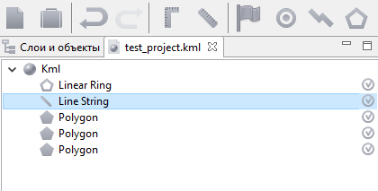
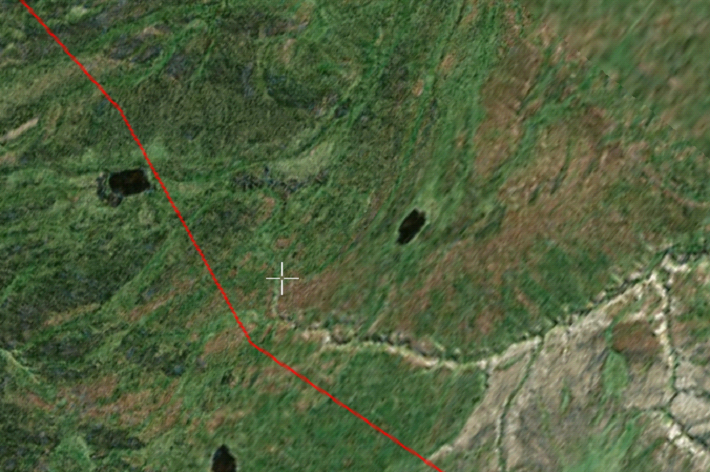

Использование карт
=======================

В программе Geoscan Planner в качестве базовой карты использует несколько источников данных о земной поверхности:**Bing,Landsat** или **OpenStreetMap** (для загрузки необходимо интернет-подключение). Выбор источника данных осуществляется в пункте меню **Настройки > Покрытие** (рис. 21).

Помимо собственно карт, из сети Интернет загружаются важные для полета данные о высотах местности. Выбор источника данных о рельефе также доступен в пункте меню **Настройки > Покрытие** (рис. 21).

   Рис. 21. Выбор источника данных о земной поверхности

Для составления корректного полетного задания необходимо подгрузить всю территорию предполагаемого полета, желательно в максимальной детализации. Для этой цели в программу встроен специальный инструмент: **Настройки > Покрытие > Закэшировать покрытие**. При нажатии кэшируется область, отображаемая в данный момент на экране.

Во время загрузки данных в правом нижнем углу карты отображается индикатор загрузки (рис. 22), который исчезает после загрузки всего отображаемого на экране участка карты в текущем масштабе.

   Рис. 22. Индикатор загрузки

Если из-за проблем с интернет-подключением данные не могут быть загружены, в правом нижнем углу карты появится сообщение **Нет сети**, написанное красным цветом (рис. 23).

   Рис. 23. Оповещение об отсутствии сети

.. attention:: В качестве карты высот используются данные SRTM, которые могут быть неактуальными для выбранных участков местности. Рекомендуется подгружать более свежие данные о рельефе через пользовательские карты

Данные о земной поверхности сохраняются на диске и доступны во время полета без подключения к интернету после однократной загрузки какого-либо участка

Загрузка пользовательских карт
-----------------------------------------

Загрузка сторонних карт доступна через выпадающее меню **Проект > Открыть** или **Проект > Импортировать**.

В программе реализована поддержка мощного формата географической разметки KML, благодаря чему можно загружать векторные и растровые карты большой сложности. На рис. 24 показана структура воздушного пространства РФ в формате KML с сайта `Межрегиональной общественной организация пилотов и граждан-владельцев воздушных судов`_ (В помощь пилоту > Структура ВП > Файл структуры ВП > vprf.kmz)

.. _Межрегиональной общественной организация пилотов и граждан-владельцев воздушных судов: https://aopa.ru/

   Рис. 24. Структура ВП РФ в формате KML

На рис. 25 представлена 3d модель в формате KMZ с сайта 3dwarehouse.sketchup.com.

   Рис. 25. 3D модель в формате KMZ

На рис. 26 показаны результаты АФС, обработанные в MetaShape.

   Рис. 26. Результаты АФС, обработанные в MetaShape

Все подгруженные файлы отображаются в режиме эксперта во вкладке **Слои и объекты** (рис. 27). Для удобства работы с полученными участками можно отключить отображение исходного файлаKML, щелкнув по галочке напротив его названия.

.. figure:: _static/_images/planer_maps/karty.png 
   :align: center
   :width: 500

   Рис. 27. Отображение открытых документов в режиме эксперта

Подключение данных WMS
-----------------------------------------

Пользователю доступна возможность подгрузить данные WMS (Web Map Service). Загрузка происходит через выпадающее меню **Проект > Импортировать > WMS...** При выполнении данной команды появляется диалоговое окно, в котором можно выбрать адрес сервера WMS (или `указать свой`_). Выберите интересующие слои; данные отобразятся на карте(рис. 28).

.. _указать свой: https://pkk5.rosreestr.ru/arcgis/services/Cadastre/CadastreWMS/MapServer/ WMSServer

   Рис. 28. Карта с подключенными данными WMS сервера Росреестра

Работа с SAS.Planet
-----------------------------------------

Для скачивания карт и преобразования их в файлы, поддерживаемые программойGeoScanPlanner,вы можете воспользоваться бесплатной программой `SASPlanet`_. 

.. _SASPlanet: https:://sasgis.org

.. attention:: Во избежание возможных проблем в процессе пользования рекомендуем ознакомиться с документацией ( `F.A.Q.`_ ) по работе с программой SAS.Planet

.. _F.A.Q.: http://www.sasgis.org/forum/viewtopic.php?t=986

**Скачивание карт**. Запустите SAS.Planet, с помощью меню **Карты** выберите интересующий тип карты (рис. 29).

   Рис. 29. Выбор типа карты в SAS.Planet

Выберите масштабы карт, которые вы планируете скачать. Обратите внимание на значение z в нижней строке (рис. 30).

   Рис. 30. Значение z

Необходимо учитывать, что каждый следующий масштаб содержит в 4 раза больше информации, чем предыдущий.

Выделите интересующую область с помощью кнопки **Операции с выделенной областью** (рис. 31), после выделения появится окно с одноименным названием (рис. 32).

   Рис. 31. Запуск операций с выделенной областью

   Рис. 32. Окно операций с выделенной областью

Используя вкладку **Загрузить**, скачайте карты масштабов по порядку по выбранный максимальный уровень. Для повторного выбора той же области можно использовать комбинацию **Ctrl-B**.

Экспорт в формат KML 
----------------------------

После скачивания всех масштабов повторно вызовите окно **Операции с выделенной областью (Ctrl-B)** и выберите вкладку **Экспорт**, в строке **Экспорт выделенного участка в формат** выберите **KML (для просмотра в GE)**. Укажите все скачанные масштабы, например, с 12 по 17. Выберите интересующий источник данных. Активируйте опции **Относительный путь к тайлам** и **Не сохранять пути..** (рис. 33).

   Рис. 33. Операции с выделенной областью

Укажите путь для сохранения файла с экспортированными данными в каталог *[путь до SASPlanet]/cache* (в результате пути до тайлов будут относительные, что позволит перемещать всю папку cache целиком). Нажмите **Начать**. При необходимости скопировать карту на другой компьютер копируйте папку cache целиком – вместе с kml и картинками.

Чтобы создать kmz-файл, поместите в архив файл kml и содержимое папки *cache* (рис. 34).

   Рис. 34. Создание архива

.. attention:: В папке cache хранится весь кэш программы SAS.Planet, соответственно, все ранее загруженные карты хранятся в этой папке. Будьте внимательны, архивируйте только нужную часть. Либо перед каждой новой загрузкой карт удаляйте папку cache целиком.

Выберите формат архива zip, введите название архива и нажмите ОК (рис. 35).

   Рис. 35. Создание файла kmz

У полученного архива смените расширение на .kmz.

**Экспорт в формат GeoTIFF.** После скачивания всех масштабов повторно вызовите окно **Операции с выделенной областью (Ctrl-B)** и выберите вкладку **Склеить**,в строке **Результирующий формат** выберите **GeoTIFF (Tagged Image File Format)**. Укажите необходимый масштаб и место для сохранения файла geotiff. Выберите интересующий источник данных. При необходимости разбейте изображение на нужное количество частей (рис.36).

   Рис. 36. Создание файла geotiff

.. attention:: Открывать полученные файлы geotiff в программе GeoScan Planner рекомендуется через выпадающее меню **Проект > Импортировать > Растровую карту..** с последующим выбором **Оптимизировать для ускорения**.

**Экспорт в формат KMZ**. После скачивания всех масштабов повторно вызовите окно **Операции с выделенной областью (Ctrl-B)** и выберите вкладку **Склеить**, в строке **Результирующий формат** выберите **KMZ for Garmin (JPEG Overlays)**. Укажите необходимый масштаб и место для сохранения файла kmz. Выберите интересующий источник данных. При необходимости разбейте изображение на нужное количество частей (рис. 37).

   Рис. 37. Создание файла kmz

**Экспорт в формат PNG с географической привязкой KML**. После скачивания всех масштабов повторно вызовите окно **Операции с выделенной областью (Ctrl-B)** и выберите вкладку **Склеить**, в строке **Результирующий формат** выберите **PNG (Portable Network Graphics)**. Укажите необходимый масштаб и место для сохранения файла png. Выберите интересующий источник данных. В разделе **Создать файл привязки** выберите .kml. При необходимости разбейте изображение на нужное количество частей (рис. 38).

   Рис. 38. Создание файла png с файлом привязки kml

.. attention:: Открытие данных файлов PNG в программе GeoScan Planner происходит через открытие файла привязки kml.

Создание документа KML
-----------------------------------------

Помимо загрузки файлов KML, программа GeoScan Planner поддерживает создание файлов KML. Для создания файла KML выполните **Проект > Создать > KML..** (рис. 39).

   Рис. 39. Запуск создания KML

Укажите место сохранения файла и его название (рис. 40).

   Рис. 40. Создание файла KML

Откройте созданный файл в редакторе (рис.41). Для этого перейдите в режим эксперта и щелкните правой кнопкой мыши по нужному файлу.

   Рис. 41. Открытие файла KML в редакторе

Файл открывается в редакторе, при этом на панели инструментов появляются дополнительные кнопки (рис. 42):

   Рис. 42. Элементы KML на панели инструментов в режиме редактора

1. создать точку; 
2. создать линию; 
3. создать кольцо;
4. создать полигон. 

Создайте элемент KML, например, полигон (рис. 43).

   Рис. 43. Создание полигона KML

В дереве файла KML появляется созданный элемент (*в данном случае Polygon*) и появляется раздел настройки стилей отображения (рис. 44).

   Рис. 44. Элементы KML

В свойствах стилей можно настроить цвет и прозрачность отображения элементов объекта, а также обводки (рис. 45).

   Рис. 45. Настройка отображения элементов KML

Редактор KML можно закрывать (рис. 46).

   Рис. 46. Закрытие редактора KML

Исправление ошибки отображения линий KML
----------------------------------------------

Может получиться так, что при открытии файла KML линейный объект окажется под рельефом.
Чтобы исправить это, необходимо: 
⇒ в режиме эксперта открыть данный файл KML в редакторе (рис. 47)

   Рис. 47. Открытие редактора KML 

⇒ в дереве объектов выбрать нужный элемент – линию (*LineString*) (рис. 48).

   Рис. 48. Выбор объекта LineString 

⇒ в окне **Свойства** выставить следующие значения (рис. 49): 

* для параметра **Режим высоты** значение **clampToGround**; 
* для параметра **Тесселяция** значение **True**. После вышеописанных действий линия на карте начинает отображаться по рельефу (рис. 50).

   Рис. 49. Редактирование свойств объекта LineString

   Рис. 50. Отображение линии KML по рельефу
