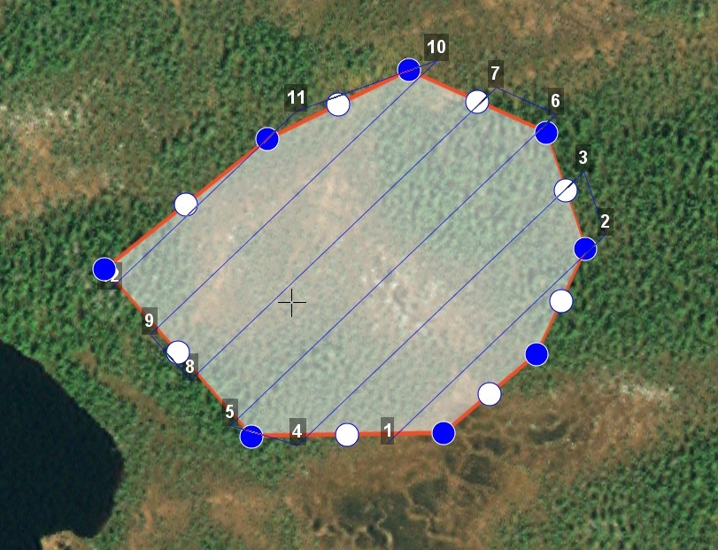

Проектирование полетного задания
=================================

Комплекс Геоскан Gemini обеспечивает: 

* площадную аэрофотосъемку по заранее составленному полетному заданию;
* линейную аэрофотосъемку по заранее составленному полетному заданию; 
* полет по точкам;  
* точку ожидания с возможностью измерения ветра; 
* полет по требованию; 
* дистанционное управление.

Программа Geoscan Planner автоматически сохраняет проект полетного задания в памяти компьютера для дальнейшего использования. Это позволяет разработать проект заблаговременно, до выезда на место проведения работ.
Для создания нового проекта нажмите на соответствующую кнопку на панели инструментов (рис. 51) или воспользуйтесь выпадающим меню **Проект** (рис. 52).

   Рис. 51. Создание нового проекта

   Рис. 52. Создание нового проекта через выпадающее меню Проект

В появившемся окне создания нового проекта полетного задания (рис. 53) укажите имя проекта и модель БВС. Укажите параметры съемки, которые будут применены по умолчанию для полетных элементов (при необходимости их можно скорректировать в режиме эксперта): 

* Разрешение (см/пикс); 
* Высота (м);
* Продольное перекрытие (%); 
* Поперечное перекрытие (%).

.. attention:: Параметры **Разрешение** и **Высота** взаимосвязаны, в зависимости от выбранной модели фотоаппарата при изменении одного из параметров второй будет рассчитываться автоматически.

   Рис. 53. Создание нового проекта полетного задания

Функциональные элементы полетного задания: 

* ПАФС - площадная аэрофотосъемка (съемка полигонов). Оператор задает вершины многоугольника (не менее 3), а программа автоматически рассчитывает маршрут обхода; 
* ЛАФС - линейная аэрофотосъемка (съемка линейных протяженных объектов, таких как трубопроводы, дороги, ЛЭП). Оператор задает по  частям линейный объект,программа обсчитывает маршрут обхода с учетом требований для съемки протяженных объектов; 
* полет по точкам - движение по заданной траектории с указанием высот облета. Используется, главным образом, для обхода точечных объектов (например, вышек) и неровностей рельефа; 
* точка ожидания - точка, которую коптер удерживает в течение указанного промежутка времени. Позволяет измерять направление и силу ветра; 
* точка посадки.
  

При необходимости многократного повторения одного маршрута за один полет (например, для контроля территории), можно активировать функцию **Зациклить ПЗ**. В таком случае БВС будет повторять все полетные элементы, кроме посадки. Для этого перейдите в режим Эксперта, выберите текущее полетное задание и активируйте одноименную функцию во вкладке **Свойства** (рис. 54).

   Рис. 54. Зацикливание полетного задания

Площадная аэрофотосъемка
-----------------------------------------

Площадная аэрофотосъемка – съемка полигонов. Полигон — это область, ограниченная многоугольником. Оператор задает вершины многоугольника (не менее 3), а программа автоматически рассчитывает маршрут обхода.

Для создания полигона нажмите кнопку **Создать площадную аэрофотосъемку** на панели инструментов (рис. 55).

   Рис. 55. Создание площадной аэрофотосъемки

Одиночными щелчками мыши задайте угловые точки исследуемого участка местности. Программа автоматически рассчитывает маршрут обхода полигона.

Оператору достаточно создать полигон непосредственно по границам исследуемой области, программа самостоятельно увеличит длину линий облета и их количество в соответствии с условиями съемки.

Полетное задание может включать в себя несколько полигонов. Если на местности имеются высокие объекты, необходимо убедиться в том, что траектория БВС при переходе от одного полигона к другому не пересекается с ними.

При необходимости можно добавить в полетное задание полет по точкам между полигонами, который должен представлять собой маршрут безопасного обхода высоких объектов. Подробнее о полете по точкам написано далее.

**Добавление и удаление вершин полигона**. В готовый полигон можно добавлять вершины. Для этого перетащите любую промежуточную точку с середины ребра полигона (прозрачная точка) в необходимое место (рис. 56). Новая вершина появится в указанном месте. Удаление вершины происходит через контекстное меню необходимой вершины.

   Рис. 56. Добавление новой вершины полигона

**Изменение направления линий облета**. Все вновь создаваемые полигоны по умолчанию оптимизированы «по качеству», т.е. направление линий рассчитано программой с учетом геометрии полигона. Необходимость оптимизировать полигон «по направлению» возникает достаточно часто, например, если на месте проведения работ сила и направление ветра неблагоприятны.

Для изменения типа оптимизации щелкните правой кнопкой мыши на полигоне и выберите в контекстном меню вариант **Оптимизация «направление»** (рис. 57).

   Рис. 57. Оптимизация по направлению

Одна из вершин полигона будет  подсвечена, на ней появится бегунок для задания направления (рис. 58).

.. figure:: _static/_images/planer_mission/direct_correction.png 
   :align: center
   :width: 400

   Рис. 58. Корректировка направления облета

Результатом будет новый маршрут облета полигона по заданному направлению (рис. 59).

   Рис. 59. Новый маршрут облета

Изменение точки входа в полигон. Если необходимо сменить точку входа в полигон, то выполните следующие действия: 

* Выделите полигон (рис. 60);

   Рис. 60. Выделенный полигон

* Правой кнопкой мыши выделите точку, в которой нужно осуществить вход. В появившемся контекстном меню выберите **Начать здесь** (рис. 61);

   Рис. 61. Изменение точки входа в полигон 

* У выбранной точки входа появится флажок (рис. 62);

   Рис. 62. Точка входа в полигон

* Чтобы вернуться к автоматическому выбору точки входа, в контекстном меню любой вершины нажмите Начать авто (рис. 63).

   Рис. 63. Точка входа в полигон

**Редактирование полигона в режиме эксперта.** Параметры автоматически создаваемого полигона оптимизированы для стандартных условий применения комплекса. В некоторых случаях для получения наилучшего результата требуется изменить параметры полигона.В частности,при сильном ветре желательно скорректировать направление линий облета, развернув их перпендикулярно ветру. Эта мера положительно влияет на стабильность траектории.

Для редактирования свойств полигона перейдите в режим эксперта, нажав на кнопку Эксперт на панели выбора режима (рис. 64).

   Рис. 64. Переход в режим эксперта

В рабочей области программы появится несколько новых окон: 

* **Слои и объекты**. На вкладке Слои и объекты отображается дерево всей рабочей сессии: проекты и объекты KML (если подключены). На вкладке с названием проекта отображается дерево проекта. 

* **Свойства**. В этом окне отображаются свойства выбранного объекта. 
* **Маршрут**. В этом окне отображается таблица точек маршрута или его чаи. Редактирование значений напрямую в таблице невозможно. 
* **Параметры автопилота**. В этом окне отображаются параметры автопилота. 
* **Фоновые задачи**. В этом окне отображается ход выполнения задач. В дереве проекта левой кнопкой мыши выберите полигон для редактирования (Площадная аэрофотосъемка).

В окне **Свойства** настройте параметры в соответствии с требованиями (рис. 65):

   Рис. 65. Редактирование свойств полигона

* **Разрешение** – разрешение фотосъемки, см/пиксель;
* **Продольное перекрытие** – расчетное продольное перекрытие снимков, %;
* **Поперечное перекрытие** – расчетное поперечное перекрытие снимков, %;
* **Целевое превышение** – высота полета, в метрах; 
* **Шаг** - интервал между линиями облета полигона, в метрах; 
* **Базис фотографирования** – интервал между ближайшими точками фотографирования на линии заданного пути, в метрах (рассчитываемая величина); 
* **Коэффициент заступа** – залеты за границы области съемки для обеспечения дополнительного перекрытия (количество дополнительных снимков за границами указанной области снимков); 
* **Угол наклона камеры** – задание угла наклона фотокамеры при осуществлении аэрофотосъемки (0 – горизонт, 90 – надир); 
* **Оптимизация** – выбор типа оптимизации полетного задания: 

    **Качество** – (по умолчанию) НСУ рассчитывает маршрут таким образом, чтобы получить наилучшее качество фотоснимков при стандартных условиях; 

    **Направление** – направление линий облета задается оператором. 

Если выбрана оптимизация по направлению, то необходимо указать соответствующий угол (поле для ввода появится, как только в поле «оптимизация» будет выбрано значение «направление»). При активации оптимизации по направлению появляется также свойство **«Маршрут на одной высоте»**. При отключенном варианте маршрут строится с огибанием рельефа (под каждым галсом ищется максимально возвышенная точка по рельефу, к которой добавляется целевое превышение). При включенном варианте на всем участке находится максимально возвышенная точка по рельефу, к которой добавляется целевое превышение (рис. 66).

   Рис. 66. Откл/Вкл режим построения маршрута на одной высоте

.. attention:: **Разрешение**, **целевое превышение** и **шаг** являются взаимозависимыми величинами. Изменение любой из них приведет к пересчету остальных

.. Использование элемента ПАФС для магнитометрической съемки. Вследствие принципа действия привязного магнитометра при выполнении работ по магнитометрической съемке обязательным условием является точное огибание рельефа на всех участках полета. Соответственно, стандартный вариант построения галсов не подходит. При создании проекта без фотоаппарата в свойствах элемента Площадная аэрофотосъемка появляется новое свойство – Задать шаг разбиения, позволяющее программе GeoScan Planner автоматически «разбивать» галс путем добавления промежуточных точек с заданным шагом в метрах (рис.67).

Линейная аэрофотосъемка
-----------------------------------------

Линейная аэрофотосъемка служит для облета линейных протяженных объектов, таких как: реки, дороги, ЛЭП, газо- и нефтепроводы. Чтобы создать линейную аэрофотосъемку, нажмите на соответствующую кнопку на панели инструментов (рис. 69).

   Рис. 69. Создание области линейной аэрофотосъемки

Однократными щелчками задайте маршрут обхода протяженного объекта по точкам разворотов. Программа автоматически построит линии облета (рис. 70).

   Рис. 70. Пример линейной аэрофотосъемки

В режиме эксперта можно отредактировать ширину снимаемой области, а также аналогичные полигону свойства (разрешение, перекрытия, превышение, шаг). По умолчанию выбрана ширина области 100 м (по 50 м в обе стороны от осевой линии) – это та область, которая должна попасть на фотоснимки.

В окне **Свойства** настройте параметры в соответствии с требованиями (рис. 71):

   Рис. 71. Свойства линейной аэрофотосъемки

* **Разрешение** - разрешение фотосъемки, см/пиксель; 
* **Продольное перекрытие** - расчетное продольное перекрытие снимков, %; 
* **Поперечное перекрытие** - расчетное поперечное перекрытие снимков, %; 
* **Целевое превышение** - высота полета, в метрах; 
* **Шаг** - интервал между линиями облета полигона, в метрах; 
* **Базис фотографирования** - интервал между ближайшими точками фотографирования на линии заданного пути, в метрах (рассчитываемая величина); 
* **Ширина** - ширина снимаемой области, в метрах.

При увеличении ширины высота, перекрытие и др. параметры не изменяются (т.к. они не зависят от ширины), изменяется только количество галсов вдоль осевой линии. Иногда уже построенных галсов достаточно для покрыти большей ширины, тогда количество галсов не увеличивается. Кроме того, в свойствах ЛАФС доступно 3 дополнительных возможности: 

* опция **Вернуться в стартовую точку** позволяет строить четное количество галсов (чтобы БВС прилетел назад к началу маршрута облета линейной АФС); 
* опция **Маршрут на одной высоте** позволяет выполнять полет на одной фиксированной высоте (на всем участке съемки найдется максимально возвышенная точка по рельефу, к которой добавится целевое превышение); 
* опция **Задать количество пролетов** позволяет осуществлять полеты в указанное количество пролетов. Если функция включена:

	* при изменении количества пролетов рассчитывается ширина ЛАФС; 
	* при изменении ширины рассчитывается превышение (высота съемки ЛАФС); 
	* при изменении превышения рассчитывается ширина ЛАФС.

**Изменение начальной точки ЛАФС.** Из-за особенностей рельефа и длины линейного объекта может возникнуть ситуация, когда удобнее осуществлять съемку не с крайней точки. Это позволит начать и закончить съемку линейного объекта в указанной точке. Для этого необходимо сменить начальную точку. Правой кнопкой мыши выделите точку, в которой нужно осуществить вход. В появившемся контекстном меню выберите **Начать здесь** (рис. 72).

   Рис. 72. Изменение начальной точки выполнения ЛАФС

**Встраивание других полетных элементов в ЛАФС.** Помимо выполнения линейной аэрофотосъемки возникает необходимость отснять также и площадной объект в непосредственной близости от линейного объекта. Выполнение съемки элементов по порядку не всегда эффективно, учитывая допустимую длину объекта ЛАФС. Поэтому доступна возможность «встраивания» других полетных элементов в линейную аэрофотосъемку. 
На рис. 73 изображен стандартный вариант выполнения полетного задания – сначала полностью выполняется линейная аэрофотосъемка, после чего начинается площадная аэрофотосъемка.

   Рис. 73. Стандартный порядок выполнения полетного задания

Для встраивания необходимого полетного элемента в ЛАФС перетащите выбранный полетный элемент в элемент Линейная аэрофотосъемка в режиме эксперта (рис. 74).

   Рис. 74. Перемещение полетного элемента в ЛАФС

На рис. 75 изображен полученный вариант выполнения полетного задания – сначала частично выполняется линейная аэрофотосъемка до точки, ближайшей к началу выполнения встроенного полетного элемента, после чего выполняется встроенный полетный элемент, по окончании продолжается выполнение линейной аэрофотосъемки с той же точки.

   Рис. 75. ПАФС, встроенная в ЛАФС

.. Использование элемента ЛАФС для магнитометрической съемки. Вследствие принципа действия привязного магнитометра при выполнении работ по магнитометрической съемке обязательным условием является точное огибание рельефа на всех участках полета. Соответственно, стандартный вариант построения галсов не подходит. При создании проекта без фотоаппарата в свойствах элемента Линейная аэрофотосъемка появляется новое свойство – Задать шаг разбиения, позволяющее программе GeoScan Planner автоматически «разбивать» галс путем добавления промежуточных точек с заданным шагом в метрах (рис.76).

.. Рис. 76. Свойства ЛАФС в проекте без фотоаппарата

.. Активация этой опции добавляет промежуточные точки; между соседними двумя точками маршрут строится на определенной фиксированной высоте, учитывая рельеф между этими точками (рис. 77).

Полет по точкам
-----------------------------------------

Добавление маршрутов полета по точкам в полетное задание необходимо, если в зоне полета могут оказаться точечные высотные объекты (опоры ЛЭП, трубы и т.п.). Кроме того, полет по точкам может использоваться как отдельный полетный элемент для обследования территорий. Для создания полета по точкам нажмите на соответствующую кнопку на панели инструментов (рис. 78).

Рис. 78. Создание полета по точкам

Одиночными щелчками мыши задайте маршрут полета по точкам (рис.79).

Рис. 79. Пример полета по точкам

Свойства **Полета по точкам** представлены на рис. 80. По умолчанию фотографирование во время полета по точкам не осуществляется, при необходимости пользователь вправе выбрать варианты с фотографированием: 

* Фотографировать в точках; 
* Фотографировать с шагом (м).

Рис. 80. Свойства полета по точкам

.. Так как фотокамера устанавливается на подвесе, есть возможность задания угла наклона камеры во время выполнения полета по точкам через свойство **Наклон камеры** (в градусах) (0 – горизонт, 90 – надир). 

Для построения полета по точкам на разных высотах в окне **Свойства** укажите требуемые высоты каждой из точек. Значения в столбце **Превышение** – это разность абсолютной высоты точки ПЗ и рельефа под ней. Таким образом, высота рельефа обязательно учитывается. Абсолютные высоты точек также доступны для редактирования через столбец **Высота**. Кроме этого, высоту можно изменять визуальным редактированием (потянуть мышкой с нажатой клавишей Shift). Кроме того, коптер способен «зависать» в указанной точке в течение указанного времени для данной точки в окне свойств в столбце **Задержка**. Задать задержку в точке можно также с помощью контекстного меню точки. Для этого щелкните правой кнопкой мыши по необходимой точке, выберите вариант Задать задержку в точке и укажите время в секундах (рис. 81). 

В программе предусмотрено 2 варианта оптимизации построения полета по точкам (рис. 82): 

* По умолчанию – стандартный вариант для осуществления полета по точкам; 
* Верховой осмотр – вариант для автоматического облета ключевых точек.

Рис. 81. Задание задержки в точке

Рис. 82. Выбор оптимизации построения полета по точкам

Оптимизация по умолчанию. Этот вариант предусматривает настройку курсового режима коптера, который будет сохраняться относительно линий полета по точкам (рис. 83): 

* Обычный – при достижении каждой точки курс коптера будет автоматически выставляться на следующую маршрутную точку; 
* Налево – курс коптера будет выдерживаться перпендикулярно в левую сторону относительно линий маршрута между точками; 
* Направо – курс коптера будет выдерживаться перпендикулярно в правую сторону относительно линий маршрута между точками. 

Совмещение данных возможностей по настройке курсового режима с указанием угла наклона фотокамеры позволяет осуществить съемку объектов сложной формы.

Рис. 83. Свойства полета по точкам с оптимизацией «По умолчанию»

**Оптимизация для верхового осмотра.** Этот вариант предназначен для автоматического облета ключевых точек объекта (например, опоры ЛЭП). Задание высоты над объектом и радиуса облета задается через таблицу ключевых точек в окне **Свойства – Доп. превышение** и **Радиус** соответственно (рис. 84).

Рис. 84. Свойства полета по точкам с оптимизацией «Верховой осмотр»

В дополнение к облету ключевых точек можно осуществить облет пролетов между точками, активировав свойство Облет пролетов и задав значения отступа и превышения относительно пролетов. В такой ситуации коптер также осуществит полет между точками на заданном удалении по высоте и направлению (рис. 85).

Рис. 85. Верховой осмотр с ОТКЛ/ВКЛ вариантом облета пролетов

Точка ожидания
-----------------------------------------

Точка ожидания служит для удержания указанной точки на указанной высоте в течение указанного промежутка времени. Также точка ожидания позволяет измерять направление и силу ветра на указанной высоте. Для создания точки ожидания нажмите на одноименную кнопку на панели инструментов (рис. 86).

Рис. 86. Создание точки ожидания

Щелчком мыши задайте точку, в которой должно осуществляться ожидание; БВС будет на заданной высоте «удерживать» точку в течение указанного времени, после чего отправится по запланированному маршруту. В экспертном режиме можно изменить свойства: задать высоту точки ожидания, длительность ожидания и активировать функции измерения ветра или бесконечного ожидания (рис. 87).

Рис. 87. Свойства точки ожидания

При активации варианта **Измерение ветра** длительность автоматически выставляется в значение 15 секунд. При этом точка ожидания окрасится в желтый цвет (рис. 88).

Рис. 88. Точка измерения ветра

.. attention:: Рекомендуется устанавливать точку ожидания с измерением ветра перед каждым полетным элементом на высоте полетного элемента. БВС, учитывая измеренные данные о ветре, будет плавнее идти по маршруту

Функция Бесконечное ожидание служит для постоянного удержания точки (пока не сработает отказ по низкому заряду АКБ, приводящий к автоматическому возврату). При этом цвет точки ожидания сменяется на темно-синий.

Точка посадки
-----------------------------------------

Задавать точку посадки вручную необязательное. При отсутствии заданной точки посадки в проекте полетного задания БВС осуществляет автоматический возврат к точке взлета, где выполняет посадку. При необходимости посадки в другом месте добавьте точку посадки в проект полетного задания. Для этого нажмите на кнопку **Указать точку посадки** (рис. 89) и укажите необходимое место на карте.

Рис. 89. Создание точки посадки

Построится маршрут посадки (рис. 90).

Рис. 90. Пример точки посадки

Маршрут посадки состоит из 3 точек, в каждой из которых происходит замедление вертикальной скорости (скорости снижения): 

* с точки начала посадки [на высоте ПЗ] (точка 17 на рис. 90) до промежуточной точки маршрута посадки (точка 18 на рис.90) осуществляется снижение с вертикальной скоростью 5 м/с; 
* с промежуточной точки маршрута посадки [на высоте 50 м от заданной точки посадки] (точка 18 на рис. 90) до крайней точки ПЗ (точка 19 на рис. 90) осуществляется снижение с вертикальной скоростью 3 м/с;
* с крайней точки ПЗ [на высоте 25 м от заданной точки посадки] (точка 19 на рис. 90) до поверхности земли осуществляется снижение со скоростью 0.5 м/с.

Панель полетного задания
-----------------------------------------

Данная панель несет основную информацию о полетном задании – отображаются данные о номере полетного задания, номинальной длине маршрута полетного задания, общая площадь всех площадных объектов съемки, общая длина всех линейных объектов съемки, а также показывается оценочное значение времени выполнения полетного задания, учитывая взлет и развороты БВС (рис. 91). 

Рис. 91. Панель полетного задания

Данные в панели полетного задания могут отображаться желтым цветом в тех случаях, когда расчетное время полета близко ко времени работы АКБ БВС по ТТХ. Служит предупреждением о возможной нехватке заряда на выполнение всей миссии (рис. 92).

Рис. 92. Предупреждение на панели полетного задания

Также данные ПЗ могут отображаться красным цветом, что говорит о слишком большой длине маршрута, на выполнение которого заряда АКБ БВС точно не хватит (рис. 93).

Рис. 93. Невозможность выполнения полетного задания

Построение полетного задания по KML
--------------------------------------------

GeoScan Planner позволяет строить полетное задание непосредственно с готовых файлов KML. Для создания полетного задания по файлу KML необходимо в первую очередь открыть нужный файл через меню **Проект > Открыть**.В появившемся окне указать формат открываемых файлов (`*`.kml; `*`.kmz) и выбрать желаемые файлы (рис. 94).

Рис. 94. Открытие файла KML

Чтобы создать полетное задание по KML, необходимо выбрать желаемый элемент открывшегося файла KML и щелкнуть по необходимому заданию на панели инструментов. Для линейных объектов – линейная аэрофотосъемка, для точечных объектов(меток) – точка ожидания, для площадных объектов – площадная аэрофотосъемка или линейная аэрофотосъемка по периметру выбранного объекта (рис. 95).

Рис. 95. Создание полетного задания по KML

необходимо учитывать ТТХ используемого БВС, ведь этот способ подходит для небольших полигонов (площадных объектов KML).
Создание сетки KML. При работе с большими полигонами рекомендуется использовать функцию **Создать сетку**, предварительно выделив желаемый полигон (рис. 96).

Рис. 96. Создание сетки

В появившемся окне выбрать желаемые параметры сетки, т.е. размеры новых участков, которые получатся из существующего полигона. И выбрать файл, в который сохранятся данные изменения (рис. 97).

Рис. 97. Редактирование параметров сетки

Результатом будет новый файл KML, в котором каждая ячейка сетки имеет свой буквенно-цифровой код, что позволит распланировать аэрофотосъемочные работы не только по времени, но и разделить из между несколькими бригадами. (рис. 98).

В экспертном режиме в разделе «Слои и объекты» для удобства работы с полученными участками можно отключить отображение исходного файла KML, щелкнув по галочке напротив его названия (рис. 99).

Рис. 99. Отключение отображения KML

Теперь можно проектировать полетное задание для конкретного участка, а не для всего полигона (рис. 100).

Рис. 100. Работа с участками полигона

Работа с проектами
-----------------------------------------

Созданный проект можно найти в пункте меню **Проект > Мои проекты** (рис. 101) или щелкнув по кнопке Мои проекты на панели инструментов (рис. 102).

Рис. 101. Пункт меню «Мои проекты»
Рис. 102. Кнопка «Мои проекты»

В окне Мои проекты можно выполнить импорт и экспорт проектов. Если вы хотите выгрузить созданный вами проект, выберите нужный проект и нажмите Экспорт. Если вы хотите загрузить в НСУ проект, нажмите Импорт и выберите нужный файл. В открывшемся окне найдите проект, журнал которого нужно передать. Можно воспользоваться поиском по дате или имени проекта (рис. 103). Выделите проект мышкой и нажмите кнопку **Экспорт**. Выберите папку, куда нужно сохранить файл формата .gcz (например, Рабочий стол, Мои документы, флешка и др.). Нажмите кнопку Сохранить.

Полученный gcz-файл является ZIP-архивом. Файл содержит проект полётного задания и журналы всех полётов по этому проекту. Этого достаточно для анализа ЧП и для передачи проекта между НСУ.
Загрузка gcz-файла в другую НСУ производится аналогично: окно **Мои проекты**, кнопка Импорт.

Рис. 103. Окно «Мои проекты»

Кроме того, доступна функция архивирования проектов. Заархивированные проекты будут удалены из окна Мои проекты, они будут храниться в архиве в указанной пользователем папке (рис. 104).

Рис. 104. Архивирование проектов